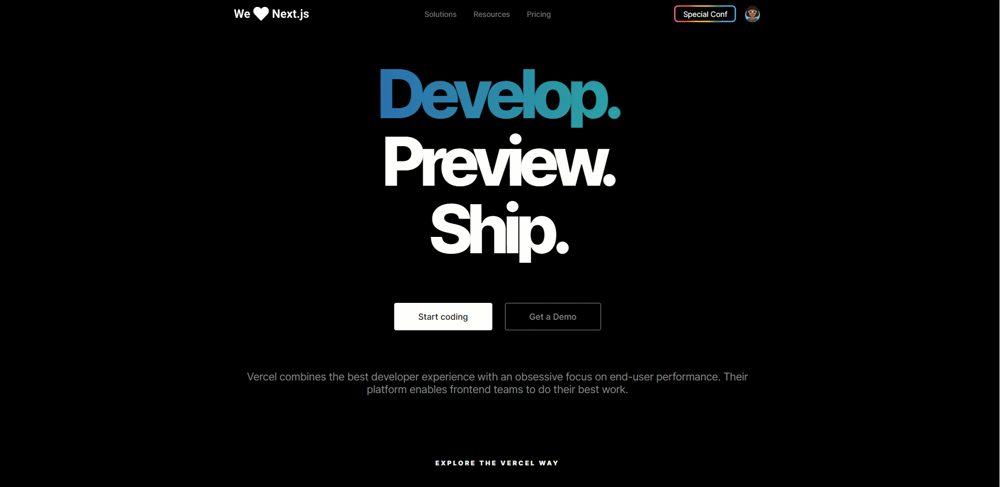

<h1 align="center">
  
  <br/>
</h1>

<p align="center">
  

  

  <a href="https://github.com/raphabarreto/vercel-homepage-clone/commits/master">
    
  </a>

  <a href="https://github.com/raphabarreto/vercel-homepage-clone/issues">
    
  </a>

  <a href="https://github.com/raphabarreto/vercel-homepage-clone/blob/master/LICENSE.md">
    
  <a>

  <a href="https://app.netlify.com/sites/vercel-homepage-clone/deploys">
    
  <a>
</p>


<p align="center">
  <a href="#-tecnologias">Tecnologias</a>&nbsp;&nbsp;&nbsp;|&nbsp;&nbsp;&nbsp;
  <a href="#-projeto">Projeto</a>&nbsp;&nbsp;&nbsp;|&nbsp;&nbsp;&nbsp;
  <a href="#-instalação">Instalação</a>&nbsp;&nbsp;&nbsp;|&nbsp;&nbsp;&nbsp;
  <a href="#-instalação">Como contribuir</a>&nbsp;&nbsp;&nbsp;|&nbsp;&nbsp;&nbsp;
  <a href="#-licença">Licença</a>
</p>

<br>


---

## ✨ Demonstração
<p >Acesse <a href="https://vercel-homepage-clone.raphabarreto.com.br/">aqui</a> para ver a demonstração do resultado final.</p>

---

## 🚀 Tecnologias

Esse projeto foi desenvolvido com as seguintes tecnologias:

- [HTML 5](https://developer.mozilla.org/pt-BR/docs/Web/HTML/HTML5)
- [CSS 3](https://developer.mozilla.org/pt-BR/docs/Web/CSS)

---
## 💻 Projeto
Esta aplicação é uma reprodução da homepage do [Vercel](https://vercel.com/), criando e integrando vários componentes da forma mais fiel possível.

---

## 🌐 Resultado
<h1 align="center">
    
</h1>

## 🔥 Instalação

```bash
# Clone este repositório
$ git clone git@github.com:raphabarreto/vercel-homepage-clone.git

# Abre o arquivo index.html no seu navegador ou através do Live Server do Visual Studio Code
```
---
## 🤔 Como contribuir

- Faça um fork desse repositório;
- Cria uma branch com a sua feature: `git checkout -b minha-feature`;
- Faça commit das suas alterações: `git commit -m 'feat: Minha nova feature'`;
- Faça push para a sua branch: `git push origin minha-feature`.

Depois que o merge da sua pull request for feito, você pode deletar a sua branch.

---


## 🧾 Licença

Esse projeto está sob a licença MIT. Veja o arquivo [LICENSE](LICENSE.md) para mais detalhes.

---

Feito com 💗 by [Raphael Barreto](https://bit.ly/contato-linkedin) graças à [Rocketseat](https://www.youtube.com/watch?v=XdqD8qi44Cg)
